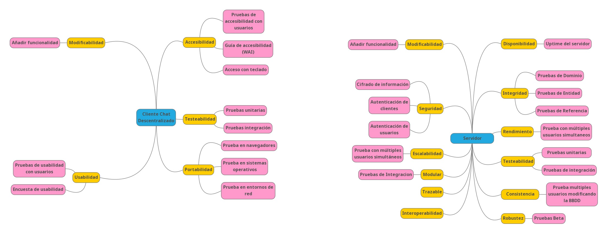

[[section-quality-scenarios]]
= Quality Requirements

== A) Árbol de calidad

A continuación se incluye el arbol con los criterios de calidad que deberán ser tenidos en cuenta en la realización del
sistema. Las hojas de este árbol son los escenarios de calidad que deberán verificarse para asegurar el correcto
cumplimiento de los criterios de calidad establecidos. Los nombres de estas hojas se corresponden por tanto con los de
los escenarios de calidad del punto siguiente.

== B) Escenarios de calidad

En este punto describimos los distintos escenarios de calidad que se deberán comprobar durante el desarrollo del sistema
parar asegurar la calidad del mismo.

=== Escenario 1: Pruebas de accesibilidad con usuarios

==== 1) Estímulo

  Uso normal de la aplicación para verificar su accesibilidad.

==== 2) Fuente del estímulo

  10 usuarios distintos con discapacidad.

==== 3) Entorno

  Sistema funcionando en condiciones normales.

==== 4) Artefactos del sistema

  Cliente Chat descentralizado

==== 5) Respuesta del sistema

  El sistema debe permitir a los usuarios utilizar de manera satisfactoria todas sus funcionalidades.

==== 6) Medida de la respuesta

  Los usuarios evaluarán su experiencia asignando una nota de 0 a 10. 
  Para validar correctamente el sistema deberá obtenerse una nota superior a 5.

=== Escenario 2: Guía de accesibilidad (WAI)

==== 1) Estímulo

  Analisis de cumplimiento de las normas de accesibilidad definidas por la Web Accesibility Initiative del W3C.

==== 2) Fuente del estímulo

  Experto en accesibilidad.

==== 3) Entorno

  Sistema funcionando en condiciones normales.

==== 4) Artefactos del sistema

  Cliente Chat descentralizado

==== 5) Respuesta del sistema

  Documento de conformidad de la accesibilidad definido en WCAG 2.1.

==== 6) Medida de la respuesta

  El documento debe indicar el cumplimiento de todos puntos de accesibilidad requeridos.

=== Escenario 3: Acceso con teclado

==== 1) Estímulo

  Utilización normal del sistema utilizando solamente un teclado para la entrada de datos.

==== 2) Fuente del estímulo

  Usuario normal del sistema.

==== 3) Entorno

  Sistema funcionando en condiciones normales.

==== 4) Artefactos del sistema

  Cliente Chat descentralizado

==== 5) Respuesta del sistema

  El sistema debe permitir la realización de todas las tareas implementadas en el mismo.

==== 6) Medida de la respuesta

  Todas las tareas deben poder realizar satisfactoriamente.

=== Escenario 4: Pruebas unitarias

==== 1) Estímulo

  Comprobación del funcionamiento de los componentes individuales que forman la aplicación.

==== 2) Fuente del estímulo

  Desarrollador.

==== 3) Entorno

Sistema en desarrollo.

==== 4) Artefactos del sistema

  Cliente Chat descentralizado y Servidor

==== 5) Respuesta del sistema

  El sistema generará un informe indicando si los test desarrollados se ejecutan correctamente.

==== 6) Medida de la respuesta

  Todos los test desarrollados deben ser correctos.

=== Escenario 5: Pruebas de integración

==== 1) Estímulo

  Comprobación del funcionamiento del sistema completo.

==== 2) Fuente del estímulo

  Desarrollador.

==== 3) Entorno

  Sistema en funcionamiento normal.

==== 4) Artefactos del sistema

  Cliente Chat descentralizado y Servidor

==== 5) Respuesta del sistema

  El sistema generará un informe indicando si los test desarrollados se ejecutan correctamente.

==== 6) Medida de la respuesta

  Todos los test desarrollados deben ser correctos.
  
=== Escenario 6: Prueba en navegadores

==== 1) Estímulo

  Ejecución de la aplicación en los 3 navegadores más utilizados (Firefox, Chrome y Edge).

==== 2) Fuente del estímulo

  Encargado de pruebas.

==== 3) Entorno

  Sistema en funcionamiento normal.

==== 4) Artefactos del sistema

  Cliente Chat descentralizado

==== 5) Respuesta del sistema

  El sistema se ejecutará normalmente en todos los navegadores.

==== 6) Medida de la respuesta

  Toda la funcionalidad implementada puede ejecutarse en todos los navegadores.

=== Escenario 7: Prueba en sistemas operativos

==== 1) Estímulo

  Ejecución de la aplicación en Windows, MacOS, Linux, Android y IPhone.

==== 2) Fuente del estímulo

  Encargado de pruebas.

==== 3) Entorno

  Sistema en funcionamiento normal.

==== 4) Artefactos del sistema

  Cliente Chat descentralizado

==== 5) Respuesta del sistema

  El sistema se ejecutará normalmente en todos los sistemas operativos.

==== 6) Medida de la respuesta

  Toda la funcionalidad implementada puede ejecutarse en todos los sistemas operativos.

=== Escenario 8: Prueba en entornos de red

==== 1) Estímulo

  Ejecución de la aplicación con distintas configuraciones de red: 
  Conexión en red local, conexión a traves de internet y red móvil.

==== 2) Fuente del estímulo

  Encargado de pruebas.

==== 3) Entorno
 
  Sistema en funcionamiento normal.

==== 4) Artefactos del sistema

  Cliente Chat descentralizado

==== 5) Respuesta del sistema

  El sistema permitirá la comunicación en todos los sistemas de red analizados.

==== 6) Medida de la respuesta

  Hay comunicación en todos los sistemas de red analizados.

=== Escenario 9: Añadir funcionalidad

==== 1) Estímulo

  Se requiere la implementación de una nueva funcionalidad en la aplicación.

==== 2) Fuente del estímulo

  Desarrollador

==== 3) Entorno

  Sistema en desarrollo.

==== 4) Artefactos del sistema

  Cliente Chat descentralizado y Servidor

==== 5) Respuesta del sistema

  Se añadirá en el sistema una nueva funcionalidad en un tiempo determinado.

==== 6) Medida de la respuesta

  Tiempo empleado, que deberá ser inferior a 8 horas para una modificación de baja complejidad.

=== Escenario 10: Pruebas de usabilidad con usuarios

==== 1) Estímulo

  Uso normal de la aplicación para verificar su usabilidad.

==== 2) Fuente del estímulo

  10 usuarios con distintos perfiles.

==== 3) Entorno

  Sistema funcionando en condiciones normales.

==== 4) Artefactos del sistema

  Cliente Chat descentralizado

==== 5) Respuesta del sistema

  El sistema debe permitir a los usuarios utilizar de manera satisfactoria todas
  sus funcionalidades sin que estos duden y en un tiempo bajo.

==== 6) Medida de la respuesta

  El tiempo empleado para la realización de cada tarea de la prueba será inferior a 1 minuto.

=== Escenario 11: Encuesta de usabilidad

==== 1) Estímulo

  Los usuarios que realizan las pruebas de usabilidad se encuestan sobre la facilidad de uso de la misma.

==== 2) Fuente del estímulo

  10 usuarios con distintos perfiles.

==== 3) Entorno

  Sistema funcionando en condiciones normales.

==== 4) Artefactos del sistema

  Cliente Chat descentralizado

==== 5) Respuesta del sistema

  Puntuación numérica (entre 0 y 10) que indique el grado de aceptación de la interfaz 
  de la aplicación por los usuarios que la prueban.

==== 6) Medida de la respuesta

  La puntuación obtenida deberá ser superior a 5.

=== Escenario 12: Cifrado de información

==== 1) Estímulo

  Durante un uso normal del sistema, el cliente y el servidor intercambian información.

==== 2) Fuente del estímulo

  Encargado de pruebas.

==== 3) Entorno

  Sistema funcionando en condiciones normales.

==== 4) Artefactos del sistema

  Servidor

==== 5) Respuesta del sistema

  Los paquetes intercambiados deberán aparecer cifrados.

==== 6) Medida de la respuesta

  No debe aparecer ningún no cifrado.

=== Escenario 13: Autenticación de clientes

==== 1) Estímulo

  Conexión de un nuevo cliente al servidor.

==== 2) Fuente del estímulo

  Encargado de pruebas.

==== 3) Entorno

  Sistema funcionando en condiciones normales.

==== 4) Artefactos del sistema

  Servidor

==== 5) Respuesta del sistema

  Se permite la conexión la aplicación cliente desarrollada solamente.

==== 6) Medida de la respuesta

  No se permite la conexión al servidor a otras aplicaciones.

=== Escenario 14: Autenticación de usuarios

==== 1) Estímulo

  Un usuario accede al sistema.

==== 2) Fuente del estímulo

  Encargado de pruebas.

==== 3) Entorno

  Sistema funcionando en condiciones normales.

==== 4) Artefactos del sistema

  Servidor

==== 5) Respuesta del sistema

  Se comprueban las credenciales del usuario que accede al sistema.

==== 6) Medida de la respuesta

  Se deniegan las conexiones de usuarios que no empleen credenciales válidas.

=== Escenario 15: Prueba con múltiples usuarios simultaneos

==== 1) Estímulo

  Acceso concurrente al sistema de multiples usuarios.

==== 2) Fuente del estímulo

  10 usuarios acceden concurrentemente.

==== 3) Entorno

  Sistema funcionando en condiciones normales.

==== 4) Artefactos del sistema

  Servidor

==== 5) Respuesta del sistema

  El sistema atiende a las peticiones realizadas en un tiempo determinado.

==== 6) Medida de la respuesta

  El tiempo de respuesta para las peticiones será inferior a 10 segundos en todos los accesos.

=== Escenario 16: Uptime del servidor

==== 1) Estímulo

  Comprobación del uptime del servidor cuando este se encuentre en producción.

==== 2) Fuente del estímulo

  Encargado de mantenimiento.

==== 3) Entorno

  Sistema funcionando en condiciones normales y en un entorno de producción.

==== 4) Artefactos del sistema

  Servidor

==== 5) Respuesta del sistema

  Tiempo que el sistema no estará caido, y responderá a todas las peticiones enviadas
  por las aplicaciones cliente.

==== 6) Medida de la respuesta

  El tiempo que el servidor permanezca caido será inferior al 0.01% del total.
  
  
=== Escenario 17: Pruebas Beta

==== 1) Estímulo

  Multiples usuarios utilizando la aplicacion con el fin de forzarla allá donde podrian darse errores.

==== 2) Fuente del estímulo

  Usuarios seleccionados para realizar las pruebas.

==== 3) Entorno

  Sistema funcionando en condiciones normales.

==== 4) Artefactos del sistema

  Servidor.

==== 5) Respuesta del sistema

  Los usuarios en esas condiciones de uso no deberian encontrar ningun error o
  o retraso con el desarrollo de la prueba.

==== 6) Medida de la respuesta

  

=== Escenario 18: Pruebas de Integración 

==== 1) Estímulo

  Probar una nueva pieza de código previamente a su integracion al
  grueso y posterior a este.

==== 2) Fuente del estímulo

  Encargado de pruebas.

==== 3) Entorno

  Fragmento de Codigo del que se espera su integración.

==== 4) Artefactos del sistema

  Servidor.

==== 5) Respuesta del sistema

  El fragmento debe de responder correctamente a estas pruebas y posteriormente
  la aplicación pasar las pruebas unitarias.

==== 6) Medida de la respuesta

  No debe ocurrir ningún error a la hora de implementarlo todo.

=== Escenario 19: Prueba Multiples Usuarios atacando la base de datos

==== 1) Estímulo

  Multiples Usuarios modificando la informacion interna de la aplicacion.

==== 2) Fuente del estímulo

  Multiples usuarios modificando la informacion guardada por la base de datos.

==== 3) Entorno

   Sistema funcionando en condiciones normales.

==== 4) Artefactos del sistema

  Servidor.

==== 5) Respuesta del sistema

  Los cambios han de persistir en el sistema correctamente con los cambios
  hechos en el orden adecuado y el resultado final sea el correcto.

==== 6) Medida de la respuesta
  
  Datos esperados al acabar las transacciones.
