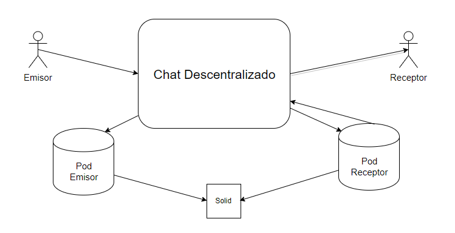

[[section-system-scope-and-context]]
== Alcance y Contexto del Sistema

=== Contexto de Negocio

[role="arc42help"]
****
.Diagrama

.Explicación
En la aplicación de chat descentralizado el usuario accedera a ella mediante su webID (preferiblemente SOLID).
El usuario podra intercambiar mensajes de texto e imágenes con otros usuarios que tengan registrados como amigos. Esos mensajes quedaran almacenados en el POD de cada usuario de forma descentralizada.
****

=== Contexto Técnico

[role="arc42help"]
****
.Diagrama

.Explicación
En este diagrama aparecen además del usuario, los profesores que corregiran el proyecto y los miembros de SOLID que valoraran la aplicación.

El login mediante SOLID hara que se cree en el POD de cada usuario una carpeta donde por cada conversación con un amigo se cree otra subcarpeta donde se va a guardar toda la información de la conversación.
****

