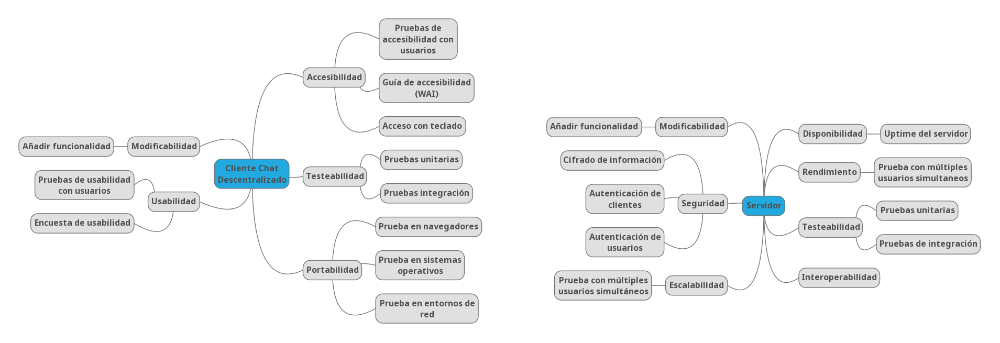

[[section-quality-scenarios]]
== Quality Requirements

=== Arbol de calidad

A continuación se incluye el arbol con los criterios de calidad que deberán ser tenidos en cuenta en la realización del
sistema. Las hojas de este árbol son los escenarios de calidad que deberán verificarse para asegurar el correcto
cumplimiento de los criterios de calidad establecidos. Los nombres de estas hojas se corresponden por tanto con los de
los escenarios de calidad del punto siguiente.

=== Escenarios de calidad

En este punto describimos los distintos escenarios de calidad que se deberán comprobar durante el desarrollo del sistema
parar asegurar la calidad del mismo.

==== Escenario 1: Pruebas de accesibilidad con usuarios

*Estimulo*

Uso normal de la aplicación para verificar su accesibilidad.

*Fuente del estímulo*

10 usuarios distintos con discapacidad.

*Entorno*

Sistema funcionando en condiciones normales.

*Artefactos del sistema*

Cliente Chat descentralizado

*Respuesta del sistema*

El sistema debe permitir a los usuarios utilizar de manera satisfactoria todas sus funcionalidades.

*Medida de la respuesta*

Los usuarios evaluarán su experiencia asignando una nota de 0 a 10. Para validar correctamente el sistema deberá
obtenerse una nota superior a 5.

==== Escenario 2: Guía de accesibilidad (WAI)

*Estímulo*

Analisis de cumplimiento de las normas de accesibilidad definidas por la Web Accesibility Initiative del W3C.

*Fuente del estímulo*

Experto en accesibilidad.

*Entorno*

Sistema funcionando en condiciones normales.

*Artefactos del sistema*

Cliente Chat descentralizado

*Respuesta del sistema*

Documento de conformidad de la accesibilidad definido en WCAG 2.1.

*Medida de la respuesta*

El documento debe indicar el cumplimiento de todos puntos de accesibilidad requeridos.

==== Escenario 3: Acceso con teclado

*Estímulo*

Utilización normal del sistema utilizando solamente un teclado para la entrada de datos.

*Fuente del estímulo*

Usuario normal del sistema.

*Entorno*

Sistema funcionando en condiciones normales.

*Artefactos del sistema*

Cliente Chat descentralizado

*Respuesta del sistema*

El sistema debe permitir la realización de todas las tareas implementadas en el mismo.

*Medida de la respuesta*

Todas las tareas deben poder realizar satisfactoriamente.

==== Escenario 4: Acceso con teclado

*Estímulo*

Utilización normal del sistema utilizando solamente un teclado para la entrada de datos.

*Fuente del estímulo*

Usuario normal del sistema.

*Entorno*

Sistema funcionando en condiciones normales.

*Artefactos del sistema*

Cliente Chat descentralizado

*Respuesta del sistema*

El sistema debe permitir la realización de todas las tareas implementadas en el mismo.

*Medida de la respuesta*

Todas las tareas deben poder realizar satisfactoriamente.

==== Escenario 5: Pruebas unitarias

*Estímulo*

Comprobación del funcionamiento de los componentes individuales que forman la aplicación.

*Fuente del estímulo*

Desarrollador.

*Entorno*

Sistema en desarrollo.

*Artefactos del sistema*

Cliente Chat descentralizado y Servidor

*Respuesta del sistema*

El sistema generará un informe indicando si los test desarrollados se ejecutan correctamente.

*Medida de la respuesta*

Todos los test desarrollados deben ser correctos.

==== Escenario 6: Pruebas de integración

*Estímulo*

Comprobación del funcionamiento del sistema completo.

*Fuente del estímulo*

Desarrollador.

*Entorno*

Sistema en funcionamiento normal.

*Artefactos del sistema*

Cliente Chat descentralizado y Servidor

*Respuesta del sistema*

El sistema generará un informe indicando si los test desarrollados se ejecutan correctamente.

*Medida de la respuesta*

Todos los test desarrollados deben ser correctos.

==== Escenario 7: Prueba en navegadores

*Estímulo*

Ejecución de la aplicación en los 3 navegadores más utilizados (Firefox, Chrome y Edge).

*Fuente del estímulo*

Encargado de pruebas.

*Entorno*

Sistema en funcionamiento normal.

*Artefactos del sistema*

Cliente Chat descentralizado

*Respuesta del sistema*

El sistema se ejecutará normalmente en todos los navegadores.

*Medida de la respuesta*

Toda la funcionalidad implementada puede ejecutarse en todos los navegadores.

==== Escenario 8: Prueba en sistemas operativos

*Estímulo*

Ejecución de la aplicación en Windows, MacOS, Linux, Android y IPhone.

*Fuente del estímulo*

Encargado de pruebas.

*Entorno*

Sistema en funcionamiento normal.

*Artefactos del sistema*

Cliente Chat descentralizado

*Respuesta del sistema*

El sistema se ejecutará normalmente en todos los sistemas operativos.

*Medida de la respuesta*

Toda la funcionalidad implementada puede ejecutarse en todos los sistemas operativos.

==== Escenario 9: Prueba en entornos de red

*Estímulo*

Ejecución de la aplicación con distintas configuraciones de red: Conexión en red local, conexión a traves de internet y
red móvil.

*Fuente del estímulo*

Encargado de pruebas.

*Entorno*

Sistema en funcionamiento normal.

*Artefactos del sistema*

Cliente Chat descentralizado

*Respuesta del sistema*

El sistema permitirá la comunicación en todos los sistemas de red analizados.

*Medida de la respuesta*

Hay comunicación en todos los sistemas de red analizados.

==== Escenario 10: Añadir funcionalidad

*Estímulo*

Se requiere la implementación de una nueva funcionalidad en la aplicación.

*Fuente del estímulo*

Desarrollador

*Entorno*

Sistema en desarrollo.

*Artefactos del sistema*

Cliente Chat descentralizado y Servidor

*Respuesta del sistema*

Se añadirá en el sistema una nueva funcionalidad en un tiempo determinado.

*Medida de la respuesta*

Tiempo empleado, que deberá ser inferior a 8 horas para una modificación de baja complejidad.

==== Escenario 11: Pruebas de usabilidad con usuarios

*Estimulo*

Uso normal de la aplicación para verificar su usabilidad.

*Fuente del estímulo*

10 usuarios con distintos perfiles.

*Entorno*

Sistema funcionando en condiciones normales.

*Artefactos del sistema*

Cliente Chat descentralizado

*Respuesta del sistema*

El sistema debe permitir a los usuarios utilizar de manera satisfactoria todas sus funcionalidades, sin que estos
duden y en un tiempo bajo.

*Medida de la respuesta*

El tiempo empleado para la realización de cada tarea de la prueba será inferior a 1 minuto.

==== Escenario 12: Encuesta de usabilidad

*Estimulo*

Los usuarios que realizan las pruebas de usabilidad se encuestan sobre la facilidad de uso de la misma.

*Fuente del estímulo*

10 usuarios con distintos perfiles.

*Entorno*

Sistema funcionando en condiciones normales.

*Artefactos del sistema*

Cliente Chat descentralizado

*Respuesta del sistema*

Puntuación numérica (entre 0 y 10) que indique el grado de aceptación de la interfaz de la aplicación por los usuarios
que la prueban.

*Medida de la respuesta*

La puntuación obtenida deberá ser superior a 5.

==== Escenario 13: Cifrado de información

*Estimulo*

Durante un uso normal del sistema, el cliente y el servidor intercambian información.

*Fuente del estímulo*

Encargado de pruebas.

*Entorno*

Sistema funcionando en condiciones normales.

*Artefactos del sistema*

Servidor

*Respuesta del sistema*

Los paquetes intercambiados deberán aparecer cifrados.

*Medida de la respuesta*

No debe aparecer ningún no cifrado.

==== Escenario 14: Autenticación de clientes

*Estimulo*

Conexión de un nuevo cliente al servidor.

*Fuente del estímulo*

Encargado de pruebas.

*Entorno*

Sistema funcionando en condiciones normales.

*Artefactos del sistema*

Servidor

*Respuesta del sistema*

Se permite la conexión la aplicación cliente desarrollada solamente.

*Medida de la respuesta*

No se permite la conexión al servidor a otras aplicaciones.

==== Escenario 15: Autenticación de usuarios

*Estimulo*

Un usuario accede al sistema.

*Fuente del estímulo*

Encargado de pruebas.

*Entorno*

Sistema funcionando en condiciones normales.

*Artefactos del sistema*

Servidor

*Respuesta del sistema*

Se comprueban las credenciales del usuario que accede al sistema.

*Medida de la respuesta*

Se deniegan las conexiones de usuarios que no empleen credenciales válidas.

==== Escenario 16: Prueba con multiples usuarios simultaneos

*Estimulo*

Acceso concurrente al sistema de multiples usuarios.

*Fuente del estímulo*

10 usuarios acceden concurrentemente.

*Entorno*

Sistema funcionando en condiciones normales.

*Artefactos del sistema*

Servidor

*Respuesta del sistema*

El sistema atiende a las peticiones realizadas en un tiempo determinado.

*Medida de la respuesta*

El tiempo de respuesta para las peticiones será inferior a 10 segundos en todos los accesos.

==== Escenario 17: Uptime del servidor

*Estimulo*

Comprobación del uptime del servidor cuando este se encuentre en producción.

*Fuente del estímulo*

Encargado de mantenimiento.

*Entorno*

Sistema funcionando en condiciones normales y en un entorno de producción.

*Artefactos del sistema*

Servidor

*Respuesta del sistema*

Tiempo que el sistema no estará caido, y responderá a todas las peticiones enviadas por las aplicaciones cliente.

*Medida de la respuesta*

El tiempo que el servidor permanezca caido será inferior al 0.01% del total.
